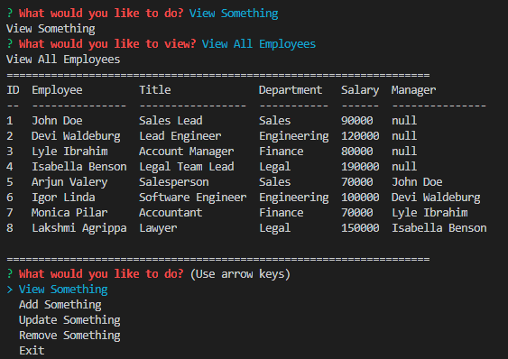
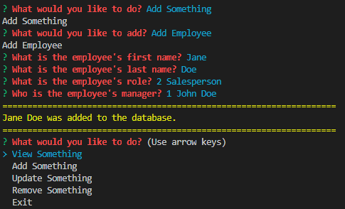
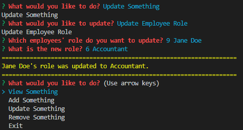
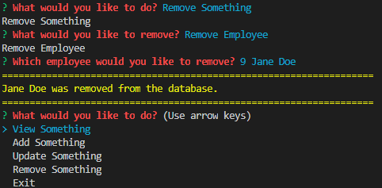

# Employee Tracker

## **Description**

---

This week's homework assignment introduces us to SQL and using SQL within node.js. The assignment is to create an interface to make it easier for a non-developer to interact with a database. The database contains three tables which contain the basic information about a company's employees, the roles or positions within the company, and the departments in the company.

No starter code was given for this assignment, everything(including the database) was created from scratch. This code can be used to view, add, update, and remove existing information from the database.

## **Link**

---

You may view the video file [here](https://github.com/peterphenow/HW9_README_Generator/blob/main/assets/README%20Generator%20presentation.webm).

## **Screenshots**

---

&nbsp;&nbsp;

&nbsp;&nbsp;

## **License**

---

This project uses the MIT license.

## **Questions**

---

If you have any questions or comments about this repository, please contact me at peter.phenow@gmail.com.

Please visit [peterphenow](https://github.com/peterphenow) to view more of my work.
